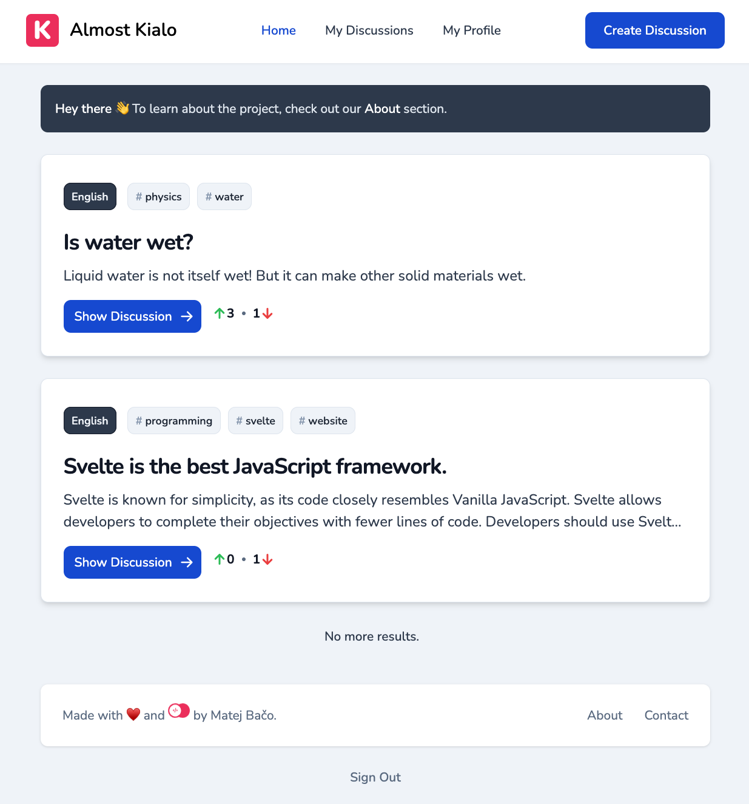
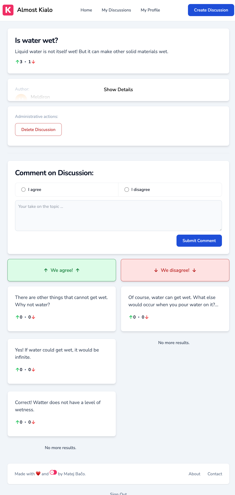
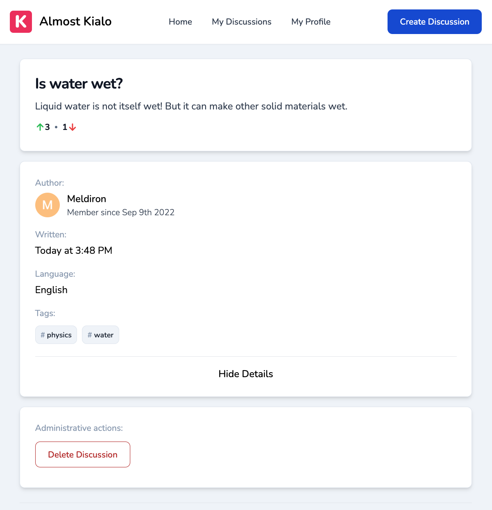
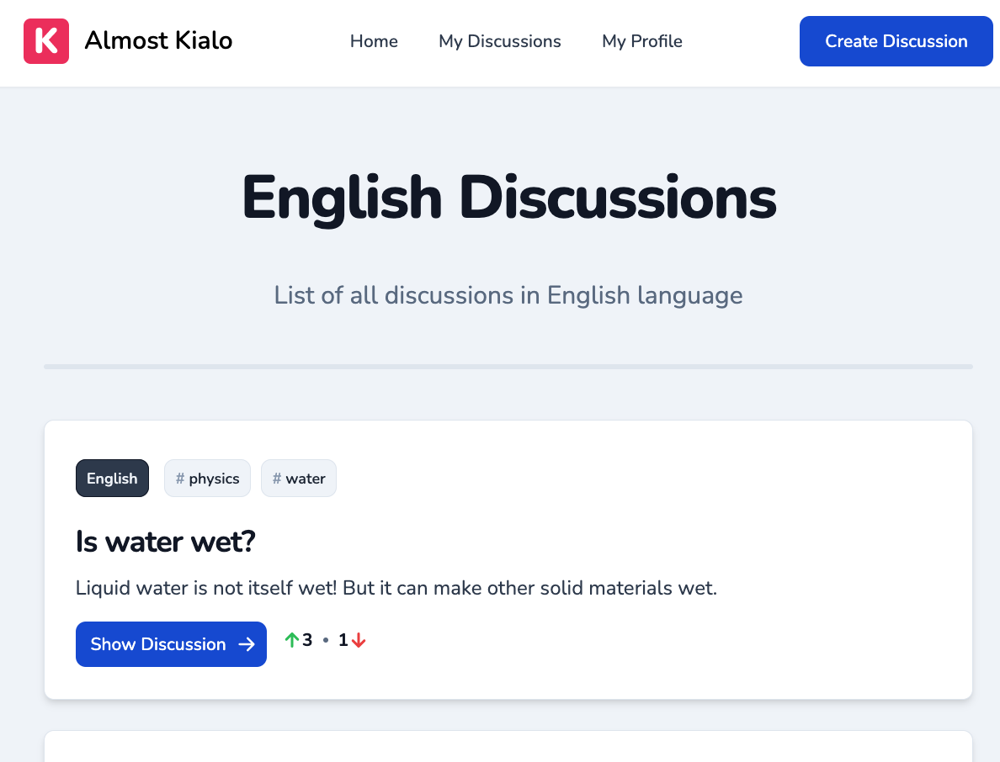
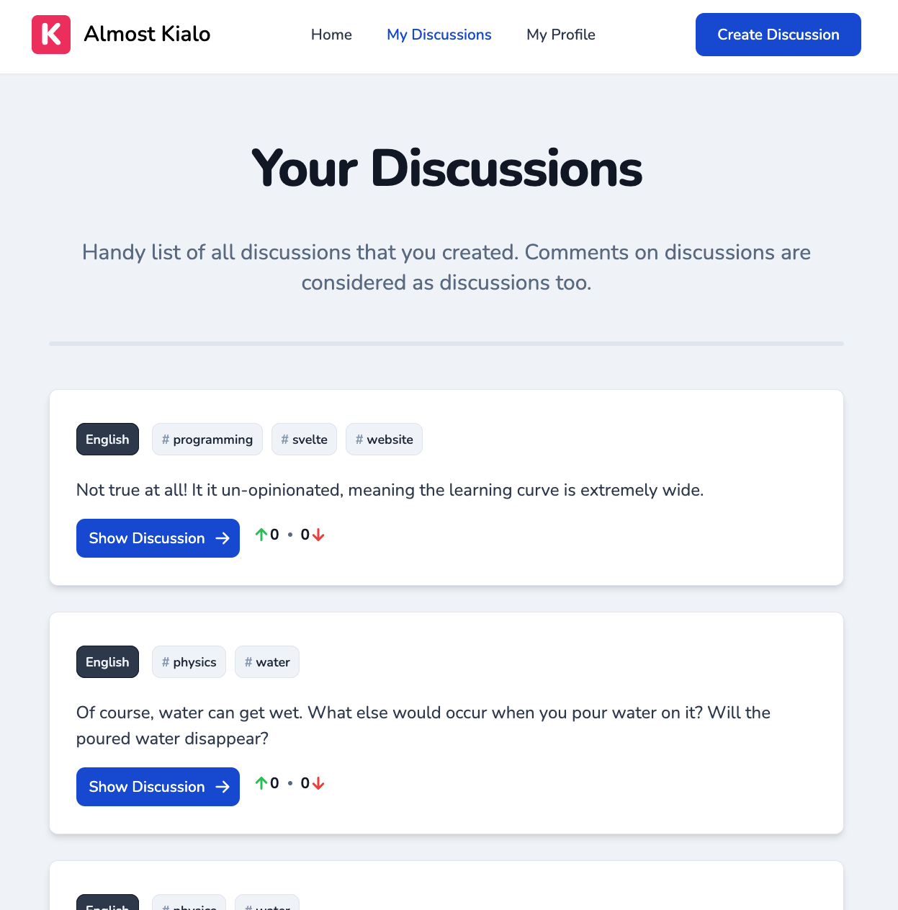
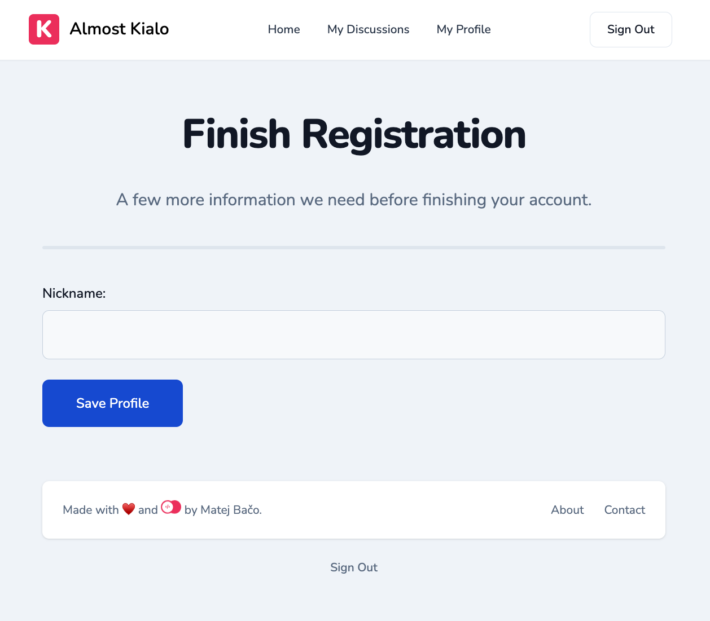

TODO:

- Search queries (tags) doesnt seem to work (index too)


# 💬 Almost Kialo

> It's like an online argument where only valid points get attention!

Almost Kialo is a social platform where you can ask <b>ANYTHING</b>! Others can express
themselves by either agreeing or disagreeing with you. Pick a side based on constructive
comments that describe their reasoning. Don't worry about unmeaningful hate! Each comment
creates a separate discussion that can be commented on too! A comment that no one agrees with is
pushed down the list and becomes irrelevant.

Idea for this project came from real project [Kialo](https://www.kialo.com/). Check them out, they are the same thing but much more sophisticated! We are in no way
affiliated or connected to Kialo website. This application came into existance as a way to
showcase amazing project that can be built using [Appwrite](https://appwrite.io/).

## 🧰 Tech Stack

- [Appwrite](https://appwrite.io/)
- [Tailwind CSS](https://tailwindcss.com/)
- [Svelte Kit](https://kit.svelte.dev/)

## 🛠️ Setup

1. Setup [Appwrite](https://appwrite.io/) 1.0
2. Use [Appwrite CLI](https://appwrite.io/docs/command-line) and run `appwrite deploy collections` and `appwrite deploy functions`
3. Create `Internal` API key, and configure `APPWRITE_FUNCTION_API_KEY` and `APPWRITE_FUNCTION_ENDPOINT` on all functions
4. Create team `Moderators` with custom ID `mods`
5. Configure GitHub OAuth

## 🏠 Development

1. Install dependencies `npm install`
2. Start Svelte Kit server `npm run dev`

## 🚀 Production

1. Build project `npm run build`

## 🧑‍🚒 Administration

1. Add trusted users to `mods` team. They can delete any discussion
2. On trusted user, set `isMod=true` their prefs

## 🖼️ Screenshots









## 🤖 Svelte Kit Generated Documentation

Everything you need to build a Svelte project, powered by [`create-svelte`](https://github.com/sveltejs/kit/tree/master/packages/create-svelte).

## Creating a project

If you're seeing this, you've probably already done this step. Congrats!

```bash
# create a new project in the current directory
npm create svelte@latest

# create a new project in my-app
npm create svelte@latest my-app
```

## Developing

Once you've created a project and installed dependencies with `npm install` (or `pnpm install` or `yarn`), start a development server:

```bash
npm run dev

# or start the server and open the app in a new browser tab
npm run dev -- --open
```

## Building

To create a production version of your app:

```bash
npm run build
```

You can preview the production build with `npm run preview`.

> To deploy your app, you may need to install an [adapter](https://kit.svelte.dev/docs/adapters) for your target environment.
