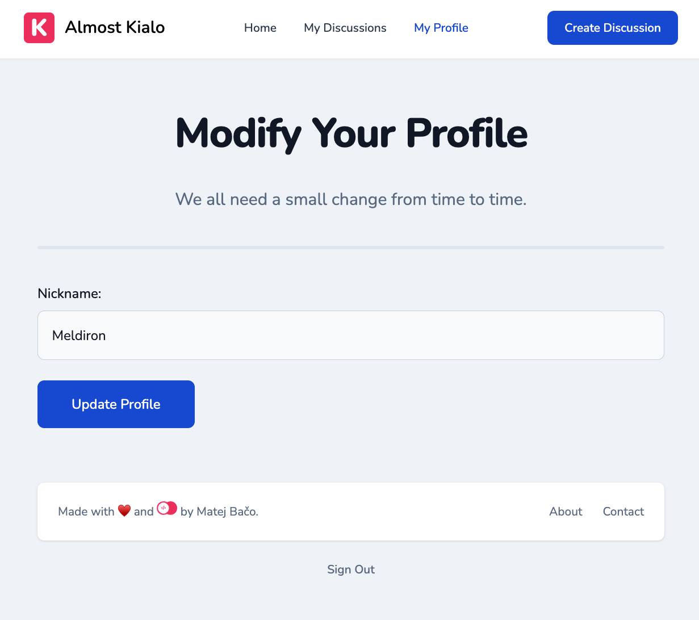

# 💬 Almost Kialo

> It's like an online argument where only valid points get attention!.

## 🧰 Tech Stack

- [Appwrite](https://appwrite.io/)
- [Tailwind CSS](https://tailwindcss.com/)
- [Svelte Kit](https://kit.svelte.dev/)

## 🛠️ Setup Server

1. Setup Appwrite server
2. Create project `almostKialo`
3. Install Appwrite CLI
4. Login with `appwrite login`
5. Enter `cd backend`
6. Deploy database structure with `appwrite deploy collection`
7. Deploy database seeds with `sh seed.sh`
8. Deploy functions with `appwrite deploy function`
9. Set variables on deployed functions. There is `backend/functions` folder for each function. They all have `README.md` describing what variables they need
10. Setup `GitHub` OAuth provider

## 👀 Setup Client

1. Install libarries `npm install`
2. Update `endpoint` in `src/lib/appwrite.ts` (Appwrite endpoint from server setup)
3. Start server `npm run dev`

## 🚀 Deploy client

1. Deploy frontend and backend on the same domain. For example, `myapp.com` and `appwrite.myapp.com`
2. Add frontend hostname as a platform in Appwrite project

## 🚨 Setup Moderation

1. Add trusted users to `mods` team. They can delete any discussion
2. On trusted user, set `isMod=true` their prefs

## 🤝 Contributing

When contributing to backend-related logic, make sure to sync-up `backend/appwrite.json` by running the `appwrite init` commands in the `backend` folder.

## 🖼️ Screenshots




## 🤖 Svelte Kit Generated Documentation

Everything you need to build a Svelte project, powered by [`create-svelte`](https://github.com/sveltejs/kit/tree/master/packages/create-svelte).

## Creating a project

If you're seeing this, you've probably already done this step. Congrats!

```bash
# create a new project in the current directory
npm create svelte@latest

# create a new project in my-app
npm create svelte@latest my-app
```

## Developing

Once you've created a project and installed dependencies with `npm install` (or `pnpm install` or `yarn`), start a development server:

```bash
npm run dev

# or start the server and open the app in a new browser tab
npm run dev -- --open
```

## Building

To create a production version of your app:

```bash
npm run build
```

You can preview the production build with `npm run preview`.

> To deploy your app, you may need to install an [adapter](https://kit.svelte.dev/docs/adapters) for your target environment.
